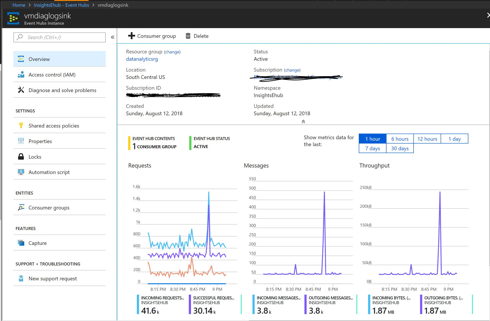
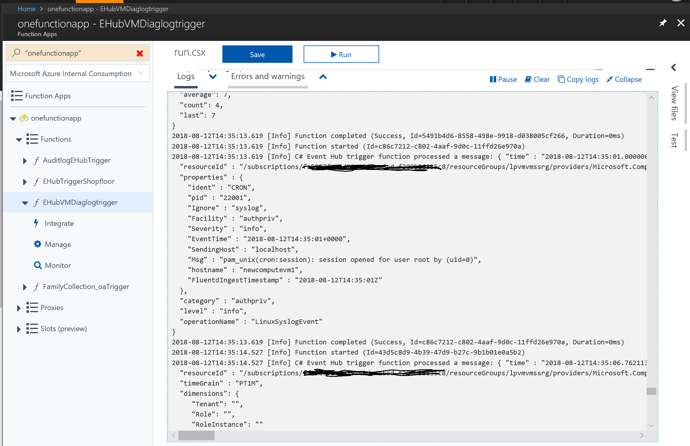

# vm-ehub-diagnostics

In this [Github repo](https://github.com/ssrikantan/logs-ehub-sink) I have shown how we could stream diagnostics from different Azure Services to Event Hubs. We cannot however use that approach for diagnostic logs from Azure VMs. 
This article demonstrates the use of Azure Event Hubs to ingest streaming Diagnostic Logs from Linux Azure Virtual Machines. Azure Functions is configured as the Event Hub Consumer that logs the incoming log stream to console. Azure Storage is used as an additional endpoint where the logs are streamed to.  

## Create an Azure Event Hub end point and generate a SAS Token
1. Create the Event Hub Namespace and an Event Hub endpoint in it

These steps are described in detail [here](https://docs.microsoft.com/en-us/azure/event-hubs/event-hubs-quickstart-portal)

2. Generate a SAS Token with permissions to send messages to this Event Hub Endpoint

Choose from any of these methods [here](https://docs.microsoft.com/en-us/rest/api/eventhub/generate-sas-token) to generate a SAS Token.
I have used a .NET Framework 4.6.1 Console Program to generate this SAS Token with permissions to send messages to this endpoint
````
using Microsoft.ServiceBus;
using Microsoft.ServiceBus.Messaging;
using System;

namespace EHClientApp
{
    /// <summary>
    /// A .NET framework 4.6.1 console App to perform management operations on Azure Event Hubs
    /// </summary>
    class Program
    {
        static void Main(string[] args)
        {
            new EHubClient().getSasKey();
        }
    }
/// <summary>
/// Creates an event Hub End point in an existing Event Hub Namespace and generates a SAS Token that has
/// permissions to send messages to this endpoint.
/// </summary>
    public class EHubClient
    {

        string serviceNamespace = "insightsehub";
        string namespaceManageKeyName = "RootManageSharedAccessKey";
        string namespaceManageKey = "<The Access key to this Event Hub>";
        string ehubname = "vmdiaglogsink";
        public void getSasKey()
        {
            try
            {
                // Create namespace manager.
                Uri uri = ServiceBusEnvironment.CreateServiceUri("sb", serviceNamespace, string.Empty);
                TokenProvider td = TokenProvider.CreateSharedAccessSignatureTokenProvider(namespaceManageKeyName, namespaceManageKey);
                NamespaceManager nm = new NamespaceManager(uri, td);

                // Create event hub with a SAS rule that enables sending to that event hub
                EventHubDescription ed = new EventHubDescription(ehubname) { PartitionCount = 32 };
                string eventHubSendKeyName = "EventHubSendKey";
                string eventHubSendKey = SharedAccessAuthorizationRule.GenerateRandomKey();
                SharedAccessAuthorizationRule eventHubSendRule = new SharedAccessAuthorizationRule
                    (eventHubSendKeyName, eventHubSendKey, new[] { AccessRights.Send });
                ed.Authorization.Add(eventHubSendRule);
                nm.CreateEventHub(ed);
                string resource = "insightsehub.servicebus.windows.net/" + ehubname;

                //Copy this SAS Key for use in configuring the VM Diagnostics
                string saskey = SharedAccessSignatureTokenProvider.GetSharedAccessSignature(eventHubSendKeyName,
                    eventHubSendKey, resource, TimeSpan.FromDays(365));
                Console.WriteLine("Event HUb Endpoint created");
            }
            catch (Exception ex)
            {
                Console.WriteLine("Exception " + ex.StackTrace);
            }
        }
    }
    }

````
The SAS Token generated would have this form
````
"SharedAccessSignature sr=insightsehub.servicebus.windows.net%2fvmdiaglogsink%2fpublishers%2fvmlogger&sig=<some code>se=<somenumber>&skn=<send key name>"
````
This has to be changed to a Https SAS Token URL before it can be used by the VM Diganostic agent. Remove 'SharedAccessSignature' from it and prefix it with 
````
'https://<your event hub namespace>/<your event hub endpoint>?'. 
````
The SAS Token URL should look like:
````
https://insightsehub.servicebus.windows.net/vmdiaglogsink?sr=..........something
````
## Create an Azure Function and configure an input trigger binding on the Event Hub configured above
Create a new Azure Function App (version 1.x is used in this example) and configure an input trigger on the Event Hub created in the earlier steps. This link https://docs.microsoft.com/en-us/azure/azure-functions/functions-create-first-azure-function pertains to configuring a HTTP Trigger, but the steps for Event Hub input triggers are similar.

## Create a Storage Account in Azure as a sink for diagnostic logs
1. Configure an Azure Storage Account

This is where the streaming Diagnostics from Azure VMs would be sent to, in addition to Azure Event Hubs. These steps are described [here](https://docs.microsoft.com/en-us/azure/storage/common/storage-quickstart-create-account?toc=%2Fazure%2Fstorage%2Fblobs%2Ftoc.json&tabs=portal)

2. Generate a SAS Token for the Storage Account

This token would be used by the Diagnostic agent to connect to the Azure Storage account and write the logs. Refer to this link [here](https://docs.microsoft.com/en-us/azure/virtual-machines/extensions/diagnostics-linux#installing-and-configuring-lad-30-via-cli) that demonstrates how the Azure portal could be used to generate the SAS Token.
The SAS Token should look something like
````
sv=2017-11-09&ss=bt&srt=co&sp=rwdlacu&se=2019-08-12T20:34:02Z&st=2018-08-12T12:34:02Z&spr=https&sig=<some code>
````
## Installing and configuring diagnostic agent on the Linux VM in Azure
In order to stream diagnostics to Event Hubs from Azure VMs, version 3.0 of the Linux Diagnostics extension is required. Refer to the article [here](https://docs.microsoft.com/en-us/azure/virtual-machines/extensions/diagnostics-linux#installing-and-configuring-lad-30-via-cli) for details. 
Refer to this article [here](https://docs.microsoft.com/en-us/azure/virtual-machines/linux/classic/diagnostic-extension-v2?toc=%2Fazure%2Fvirtual-machines%2Flinux%2Fclassic%2Ftoc.json) that talks aof enabling the extension and creating the Public Settings and Private settings json files (it pertains to the previous version of the extension, refer to it only to understand how these config setting files need to be created)

Create the PortalPublicSettings.json and PrivateConfig.json files and store them on your local computer. You will need to point to that location when running the CLI Command to install the extension subsequently.

### Create the PrivateConfig.json for the diagnostic agent
This file contains sensitive information related to connections to Event Hubs and Azure Storage. The file created for this walkthrough is as shown below:
````
{
    "storageAccountName": "vmdianglogstore",
    "storageAccountSasToken": "sv=2017-11-09&ss=bt&srt=co&sp=.........and so on",
    "sinksConfig": {
        "sink": [
            {
                "name": "vmsehubsink",
                "type": "EventHub",
                "sasURL": "https://insightsehub.servicebus.windows.net/vmdiaglogsink?sr=insightsehub.servicebus.windows.net%2fvmdiaglogsink&sig=d0BI3O5I%2b0TlHnEzuyB3.... and so on"
            },
            {
                "name": "vmsblobsink",
                "type": "JsonBlob"
            }
        ]
    }
}
````
Two sinks are configured above, one to stream to Event Hubs and the other to a JsonBlob Store in Azure

### Create the PortalPublicSettings.json for the diagnostic agent
A preconfigured JSON Document that contains all the configuration options to capture Syslog, performance metrics, etc can be downloaded from this link [here](https://raw.githubusercontent.com/Azure/azure-linux-extensions/master/Diagnostic/tests/lad_2_3_compatible_portal_pub_settings.json -O portal_public_settings.json)

Download this file to the same location as the PrivateConfig.json file created above. Make the following changes to it.

1. Add the Storage Account Name, and comma separated names of the 2 sinks that are referred in the PrivateConfig.json above. For example, in this example:
````
{
  "StorageAccount": "vmdianglogstore",
  "ladCfg": {
    "diagnosticMonitorConfiguration": {
      "sinks": "vmsehubsink,vmsblobsink",
      "eventVolume": "Medium", 
      "metrics": {
        "metricAggregation": [...... 
````

````
  "performanceCounters": {
    "sinks": "vmsehubsink,vmsblobsink",
    "performanceCounterConfiguration": [
      {
        "annotation": [
          {
            "displayName": "Disk read guest OS", 
            "locale": "en-us"
          }
        ], 
        "class": "di....... 
````

````
 "syslogEvents": {
    "sinks": "vmsehubsink,vmsblobsink",
    "syslogEventConfiguration": {
      "LOG_AUTH": "LOG_DEBUG", 
      "LOG_AUTHPRIV": "LOG_DE.....
````

2. the Resource Id of the Azure VM being configured here for diagnostics

````
{
  "StorageAccount": "vmdianglogstore",
  "ladCfg": {
    "diagnosticMonitorConfiguration": {
      "sinks": "vmsehubsink,vmsblobsink",
      "eventVolume": "Medium", 
      "metrics": {
        "metricAggregation": [
          {
            "scheduledTransferPeriod": "PT1H"
          }, 
          {
            "scheduledTransferPeriod": "PT1M"
          }
        ], 
        "resourceId": "/subscriptions/<your subscription id>/resourceGroups/<resource group of vm>/providers/Microsoft.Compute/virtualMachines/<your vm name>"
 
````
### Install the Linux Diagnostic Agent using CLI
1. Uninstall any previous versions of the Linux Diagnostic agent from the Azure Virtual Machine before running this command. This can be done from the 'extensions' blade of the VM Settings in the Azure portal

2. Use CLI to install the extension

Connect to your Subscription in CLI using 
az login
az account set --subscription <your subscription id>

az vm extension set --publisher Microsoft.Azure.Diagnostics --name LinuxDiagnostic --version 3.0 --resource-group <your vm resource group> --vm-name <your vm name> --protected-settings PrivateSettings.json --settings PortalPublicSettings.json

This command should return a JSON Response indicating a successful installation.

### Verify the configuration

1. Navigate to the VM in Azure portal, and in the 'Diagnostic Settings' blade, you should be able to see the Storage account configured through the steps above, along with the metrics and log configurations

2. Navigate to the Azure Storage Account configured above, and you should see diagnostic content in:
- Azure Tables - this is where the diagnostic data is sent to by default
- Azure Blob - this is the location configured as a sink in the PrivateConfig.json, in the steps above

3. Navigate to the Event Hub configured above. You should see the incoming telematry in the 'Messages' part of the Monitoring blade.


4. Navigate to the Azure Function created earlier. In the logs  section of the Function App, you should see the telemetry flowing in


